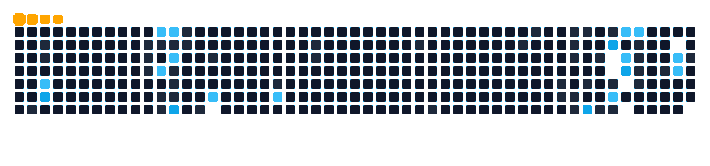

<div align="center">


<a href="https://git.io/typing-svg"></a>

<p>
  <a href="https://isina-nej.ir"></a>
  <a href="https://linkedin.com/in/isina-nej"></a>
  <a href="mailto:isina4501@gmail.com"></a>
  <a href="https://github.com/isina-nej?tab=repositories"></a>
  <a href="https://github.com/isina-nej?tab=followers"></a>
  
</p>

<sub><a href="./README-fa.markdown">فارسی</a> · <a href="https://isina-nej.vercel.app">isina-nej.vercel.app</a> · <code>isina4501@gmail.com</code></sub>

</div>

---

```ts
// now — shipping, not demoing
const sina = {
  role: "Full-stack / Flutter / Network Engineer",
  company: "Nodia — founder",
  location: "Ahwaz, Iran",
  focus: ["Pishro (Next.js 15 + Prisma/MySQL, RTL, dual-auth)", "Claude MCP tooling", "Flutter network apps"],
  stack: ["Dart/Flutter", "TypeScript/Next.js", "Python/FastAPI", "Rust/Go", "Docker/K8s"],
  principle: "ship minimal → measure → iterate"
}
```

### stack

<p align="center">
  <a href="https://skillicons.dev"></a>
</p>

<p align="center">
  <code>Dart</code> <code>Flutter</code> <code>TypeScript</code> <code>Next.js</code> <code>React</code> <code>Tailwind</code> <code>Python</code> <code>FastAPI</code> <code>Django</code> <code>Rust</code> <code>Go</code> <code>C++</code> <code>Node.js</code> <code>Docker</code> <code>K8s</code> <code>MikroTik</code> <code>Prisma</code> <code>MySQL</code>
</p>

---

<div align="center">

### 🏆


</div>

### 🐍 contributions

<div align="center">

<picture>
  <source media="(prefers-color-scheme: dark)" srcset="dist/github-snake-dark.svg" />
  <source media="(prefers-color-scheme: light)" srcset="dist/github-snake.svg" />
  
</picture>



</div>

### ⭐ featured

<div align="center">

<a href="https://github.com/isina-nej/graphify"></a>
<a href="https://github.com/isina-nej/pishro"></a>
<br/>
<a href="https://github.com/isina-nej/claude-host-mcp"></a>
<a href="https://github.com/isina-nej/FireDNS"></a>
<br/>
<a href="https://github.com/isina-nej/shop"></a>
<a href="https://github.com/isina-nej/claude-gateway-switcher"></a>

</div>

| Project | What it is | Stack |
|---|---|---|
| **Pishro** | LMS + investment platform, Next.js 15 + Prisma, RTL, dual-auth — production | `TS` `Next.js` `Prisma` `MySQL` |
| **graphify** `★5` | Any folder → queryable knowledge graph (code + DB + infra) | `Python` · Claude/Codex/Cursor skill |
| **claude-host-mcp** | 24-tool portable MCP server for Claude Desktop | `Python` `MCP` |
| **FireDNS** `★3` | Android/Windows DNS changer — lower ping, bypass sanctions → [fire-dns.ir](https://fire-dns.ir) | `Dart` `Kotlin` `C++` |
| **NotTik** | Local notification history (Android) | `Dart` `Kotlin` |
| **TinkeraRobot** | Telegram bot framework | `Python` |

> plus [shop](https://github.com/isina-nej/shop) `★3` · [noobati](https://github.com/isina-nej/noobati) `★2` · [TimeSlice](https://github.com/isina-nej/TimeSlice) · [Tinkera-chat](https://github.com/isina-nej/Tinkera-chat) — **[all 42 →](https://github.com/isina-nej?tab=repositories)**

### 📊 stats

<div align="center">


</div>

---

<div align="center">

**Open to freelance & remote — Flutter / Next.js / Python**

`isina4501@gmail.com` · [isina-nej.ir](https://isina-nej.ir) · [linkedin.com/in/isina-nej](https://linkedin.com/in/isina-nej)


</div>
